# Mira AI Agent 🤖

Mira is an intelligent Technical Program Management (TPM) assistant powered by **LangChain Agentic RAG**. It streamlines project planning, status reporting, and project knowledge retrieval using AI, allowing TPMs to focus on strategy rather than documentation.

**🔗 Live App:** [https://mira-ai-agent.streamlit.app/](https://mira-ai-agent.streamlit.app/)

---

## 🛠️ Tech Stack


---

## ✨ Key Features

### 1. 🤖 AI Assistant (LangChain Agentic RAG)
**Chat with your project documents using natural language.** Upload files or connect Google Drive, and Mira will intelligently answer questions with source citations.

- **Document Q&A:** "What are the key milestones?" / "Who is responsible for Phase 2?"
- **Auto-Indexing:** Documents are automatically vectorized using FAISS + OpenAI Embeddings
- **Source Citations:** Every answer cites the specific document it came from
- **Multi-turn Chat:** Follow-up questions with conversation memory

### 2. ☁️ Google Drive Integration
**Connect your Google Drive to index documents directly from the cloud.**

- **OAuth 2.0 Authentication:** Secure access to your Drive files
- **Folder Browsing:** Navigate and select files from any folder
- **Supported Formats:** PDF, DOCX, TXT, Excel (XLSX/XLS)
- **Google Docs Export:** Native Google Docs/Sheets are automatically exported

### 3. 📋 Intelligent Project Planning
Upload unstructured project documents to generate comprehensive, structured Project Plans.

- **Supported Formats:** PDF, DOCX, TXT, Excel
- **Output:** Executive Summary, Timeline, Risks, Resource Requirements
- **Downloads:** PDF, Word (DOCX), Markdown, Plain Text
- **Email:** Send directly to stakeholders

### 4. 📊 Automated Status Reporting
Connect your Trello board to instantly generate weekly status reports.

- **Trello Integration:** Works with Board IDs or URLs
- **Smart Analysis:** Categorizes Completed vs. In-Progress tasks
- **Risk Detection:** Automatically identifies blockers and risks
- **Export:** PDF, DOCX, Markdown with one-click email

### 5. 📋 Trello Board Actions
**Perform CRUD operations on your Trello boards directly from Mira.**

- Create new cards with descriptions, due dates, and labels
- Update existing cards (move between lists, edit details)
- Add comments and checklist items
- Archive/restore cards and lists

### 6. 📤 One-Click Sharing
- **Direct Email:** Send formatted reports to stakeholders via Gmail
- **Multi-Format Export:** PDF, DOCX, Markdown, Plain Text

---

## 🚀 Quick Start

### Prerequisites
- Python 3.9+
- OpenAI API Key
- (Optional) Trello API Key & Token
- (Optional) Google Cloud OAuth credentials

### Installation

```bash
# Clone the repository
git clone https://github.com/yourusername/Mira-AI-Agent.git
cd Mira-AI-Agent

# Install dependencies
pip install -r requirements.txt

# Run the app
streamlit run app.py
```

### Configuration

Enter your credentials in the sidebar:

| Credential | Required For | How to Get |
|------------|--------------|------------|
| **OpenAI API Key** | All AI features | [OpenAI Platform](https://platform.openai.com/api-keys) |
| **Trello Key & Token** | Status Reports, Board Actions | [Trello Power-Ups Admin](https://trello.com/power-ups/admin) |
| **Google OAuth** | Google Drive integration | [Google Cloud Console](https://console.cloud.google.com/apis/credentials) |
| **Gmail App Password** | Email sending | Google Account > Security > App Passwords |

---

## 📖 How to Use

### AI Assistant (RAG Chat)

1. Go to the **AI Assistant** tab
2. Upload documents locally OR connect Google Drive
3. Wait for auto-indexing to complete
4. Start chatting! Ask questions like:
   - "What are the key milestones?"
   - "Summarize the project scope"
   - "Generate a project plan"
   - "Create a status report for [Trello URL]"

### Project Planning

1. Go to **Project Planning** tab
2. Upload your project files (PRD, Timeline, etc.)
3. Click **Generate Plan**
4. Download as PDF/DOCX or send via email

### Status Reporting

1. Go to **Status Reports** tab
2. Enter your Trello Board URL
3. Click **Generate Report**
4. Review, download, or email to stakeholders

### Trello Board Actions

1. Go to **Board Actions** tab
2. Enter your Board ID/URL and click **Load Lists**
3. Create cards, add comments, manage checklists
4. Archive or restore cards and lists

---

## 🏗️ Architecture

```mermaid
flowchart TB
    subgraph Input["📥 Input Sources"]
        Local["💻 Local Upload"]
        GDrive["☁️ Google Drive"]
        Trello["📋 Trello API"]
    end

    subgraph Processing["⚙️ Processing"]
        DocProc["📄 Document Processor"]
        Splitter["✂️ Text Splitter"]
        Embeddings["🔢 OpenAI Embeddings"]
    end

    subgraph Storage["🗄️ Vector Store"]
        FAISS["FAISS Index"]
    end

    subgraph Agent["🤖 LangChain Agent"]
        LLM["GPT-4o-mini"]
        Tools["🔧 Tools"]
        Memory["💭 Memory"]
    end

    subgraph Output["📤 Output"]
        Chat["💬 Chat Response"]
        Plan["📋 Project Plan"]
        Report["📊 Status Report"]
        Email["📧 Email"]
    end

    Local --> DocProc
    GDrive --> DocProc
    DocProc --> Splitter
    Splitter --> Embeddings
    Embeddings --> FAISS

    Trello --> Agent
    FAISS --> Agent
    LLM --> Agent
    Tools --> Agent
    Memory --> Agent

    Agent --> Chat
    Agent --> Plan
    Agent --> Report
    Agent --> Email
```



---

## 📁 Project Structure

```
Mira-AI-Agent/
├── app.py                    # Main Streamlit application
├── requirements.txt          # Python dependencies
├── src/
│   ├── document_processor.py # File parsing & vectorization
│   ├── llm_handler.py        # LangChain Agent & LLM logic
│   ├── tools.py              # LangChain Tools (RAG, Trello, etc.)
│   ├── prompts.py            # System prompts
│   ├── trello_client.py      # Trello API client
│   ├── google_drive_client.py# Google Drive OAuth & API
│   ├── output_generator.py   # PDF/DOCX generation
│   └── email_service.py      # SMTP email sending
└── outputs/                  # Generated files (gitignored)
```

---

## 🔧 Tech Details

| Component | Technology |
|-----------|------------|
| **Frontend** | Streamlit |
| **LLM** | OpenAI GPT-4o-mini / GPT-4o / GPT-3.5 |
| **Agent Framework** | LangChain (AgentExecutor) |
| **Vector Store** | FAISS (in-memory) |
| **Embeddings** | OpenAI text-embedding-ada-002 |
| **Document Parsing** | pdfplumber, python-docx, pandas |
| **Cloud Storage** | Google Drive API v3 |
| **Task Management** | Trello REST API |
| **Deployment** | Streamlit Community Cloud |

---

## 🤝 Contributing

Contributions are welcome! Please feel free to submit a Pull Request.

---

## 📄 License

This project is licensed under the MIT License.

---

## 👨‍💻 Author

Built with ❤️ for TPMs who want to spend less time on documentation and more time driving projects forward.
